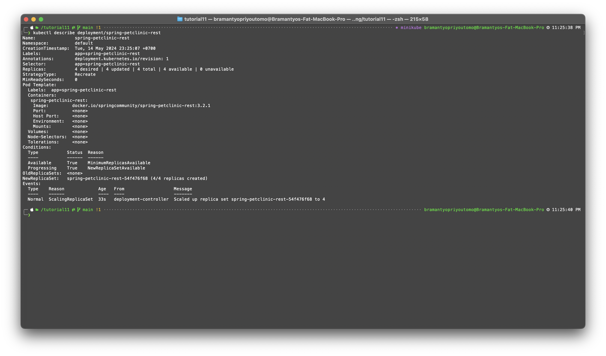
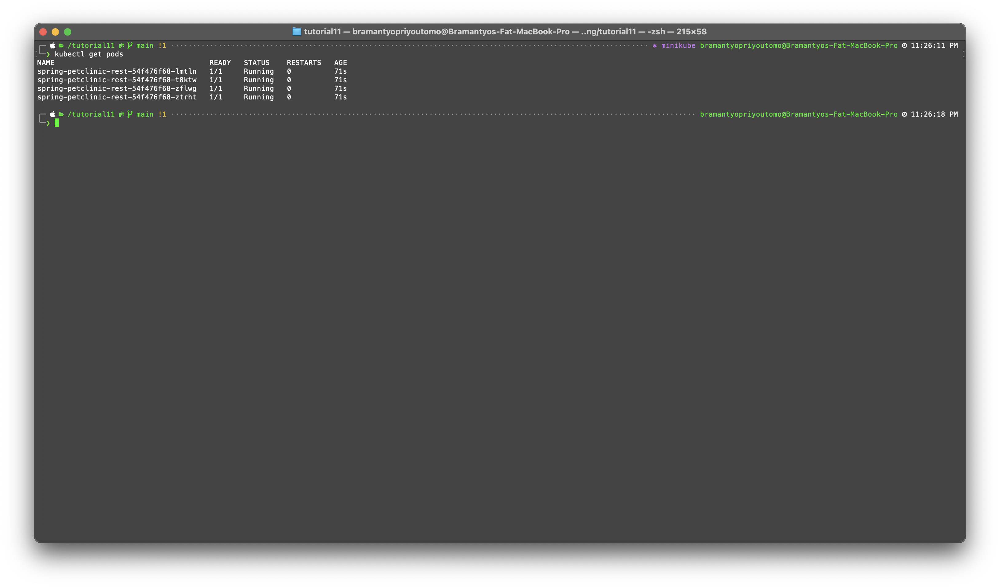

# Advanced Programming - Tutorial 11

### Reflection on Hello Minikube

1. Compare the application logs before and after you exposed it as a Service.

Before exposing the application as a Service, the logs show the initialization of the servers:


After exposing the application as a Service, additional log entries appear, indicating that the application is now receiving HTTP requests:


The log analysis indicates that exposing the application as a Service in Kubernetes successfully routes incoming HTTP requests to the application. The increase in log entries, specifically the HTTP GET requests, confirms that the application is receiving and handling client requests. Each access to the app results in a new log entry, verifying the application's response to the external requests.

2. Notice that there are two versions of `kubectl get` invocation during this tutorial section.

```shell
kubectl get pods,services
```

This command retrieves all pods and services in the default namespace.
If pods and services are created in a specific namespace other than the default, they won’t be listed here because this command does not include the -n option to specify a namespace.

```shell
kubectl get pods,services -n kube-system
```

The -n kube-system specifies that the command should operate in the kube-system namespace, which is typically used by Kubernetes for system-level pods and services, such as the Kubernetes dashboard, DNS server, etc.

Example of `kubectl get` using `-n`


### Reflection on Rolling Update & Kubernetes Manifest File

1. What is the difference between Rolling Update and Recreate deployment strategy?

* Rolling Update Strategy
The rolling update strategy updates pods gradually, ensuring some old pods remain running while new pods start. This approach minimizes downtime, maintaining continuous service availability. The process follows maxUnavailable and maxSurge parameters. maxUnavailable sets the maximum number of pods that can be offline during the update, while maxSurge defines the maximum number of additional pods above the desired count during the update. This strategy is ideal for applications that need to stay available during updates, such as web servers.

* Recreate Strategy
The recreate strategy terminates all existing pods before creating new ones, resulting in a complete replacement. This method causes full downtime of the application during the update, as there will be a period when no pods are running. It’s simpler and faster, suitable for applications where downtime is acceptable or necessary. This strategy is typically used for batch jobs, databases, or stateful applications that need a full restart to apply updates.

2. Try deploying the Spring Petclinic REST using Recreate deployment strategy and document your attempt.

* The first step I did was to rewrite the `deployment.yaml` file to replace

```yaml
strategy:
  type: RollingUpdate
  rollingUpdate:
    maxSurge: 25%
    maxUnavailable: 25%
```
with

```yaml
strategy:
  type: Recreate
```



* Below is a screenshot of the command `kubectl get pods`



3. Prepare different manifest files for executing Recreate deployment strategy.

Here is the `deployment.yaml` file that has been modified so that I use the Recreate strategy

```yaml
apiVersion: apps/v1
kind: Deployment
metadata:
  annotations:
    deployment.kubernetes.io/revision: "1"
    kubectl.kubernetes.io/last-applied-configuration: |
      {"apiVersion":"apps/v1","kind":"Deployment","metadata":{"annotations":{"deployment.kubernetes.io/revision":"4"},"creationTimestamp":"2024-05-14T06:24:06Z","generation":5,"labels":{"app":"spring-petclinic-rest"},"name":"spring-petclinic-rest","namespace":"default","resourceVersion":"10382","uid":"bd301456-8195-4874-a291-979c5e6b0467"},"spec":{"progressDeadlineSeconds":600,"replicas":4,"revisionHistoryLimit":10,"selector":{"matchLabels":{"app":"spring-petclinic-rest"}},"strategy":{"rollingUpdate":{"maxSurge":"25%","maxUnavailable":"25%"},"type":"RollingUpdate"},"template":{"metadata":{"creationTimestamp":null,"labels":{"app":"spring-petclinic-rest"}},"spec":{"containers":[{"image":"docker.io/springcommunity/spring-petclinic-rest:3.2.1","imagePullPolicy":"IfNotPresent","name":"spring-petclinic-rest","resources":{},"terminationMessagePath":"/dev/termination-log","terminationMessagePolicy":"File"}],"dnsPolicy":"ClusterFirst","restartPolicy":"Always","schedulerName":"default-scheduler","securityContext":{},"terminationGracePeriodSeconds":30}}},"status":{"availableReplicas":4,"conditions":[{"lastTransitionTime":"2024-05-14T06:30:57Z","lastUpdateTime":"2024-05-14T06:30:57Z","message":"Deployment has minimum availability.","reason":"MinimumReplicasAvailable","status":"True","type":"Available"},{"lastTransitionTime":"2024-05-14T06:24:06Z","lastUpdateTime":"2024-05-14T06:35:32Z","message":"ReplicaSet \"spring-petclinic-rest-54f476f68\" has successfully progressed.","reason":"NewReplicaSetAvailable","status":"True","type":"Progressing"}],"observedGeneration":5,"readyReplicas":4,"replicas":4,"updatedReplicas":4}}
  creationTimestamp: "2024-05-14T06:39:05Z"
  generation: 1
  labels:
    app: spring-petclinic-rest
  name: spring-petclinic-rest
  namespace: default
  resourceVersion: "471"
  uid: 70b3960d-c225-4820-8b32-60349dcfce48
spec:
  progressDeadlineSeconds: 600
  replicas: 4
  revisionHistoryLimit: 10
  selector:
    matchLabels:
      app: spring-petclinic-rest
  strategy:
    type: Recreate
  template:
    metadata:
      creationTimestamp: null
      labels:
        app: spring-petclinic-rest
    spec:
      containers:
      - image: docker.io/springcommunity/spring-petclinic-rest:3.2.1
        imagePullPolicy: IfNotPresent
        name: spring-petclinic-rest
        resources: {}
        terminationMessagePath: /dev/termination-log
        terminationMessagePolicy: File
      dnsPolicy: ClusterFirst
      restartPolicy: Always
      schedulerName: default-scheduler
      securityContext: {}
      terminationGracePeriodSeconds: 30
status:
  availableReplicas: 4
  conditions:
  - lastTransitionTime: "2024-05-14T06:39:41Z"
    lastUpdateTime: "2024-05-14T06:39:41Z"
    message: Deployment has minimum availability.
    reason: MinimumReplicasAvailable
    status: "True"
    type: Available
  - lastTransitionTime: "2024-05-14T06:39:11Z"
    lastUpdateTime: "2024-05-14T06:39:45Z"
    message: ReplicaSet "spring-petclinic-rest-54f476f68" has successfully progressed.
    reason: NewReplicaSetAvailable
    status: "True"
    type: Progressing
  observedGeneration: 1
  readyReplicas: 4
  replicas: 4
  updatedReplicas: 4
```

4. What do you think are the benefits of using Kubernetes manifest files? Recall your experience in deploying the app manually and compare it to your experience when deploying the same app by applying the manifest files (i.e., invoking `kubectl apply -f` command) to the cluster.

* Using Kubernetes manifest files simplifies the deployment process, enhances consistency, supports version control, integrates with CI/CD pipelines, and leverages Kubernetes' self-healing features. This approach significantly reduces complexity and potential errors compared to manual deployment.

* Kubernetes continuously monitors the cluster to ensure the actual state matches the desired state defined in the manifest files. This self-healing capability maintains application availability by automatically replacing failed pods, a feature that manual deployments lack without additional monitoring and intervention.
