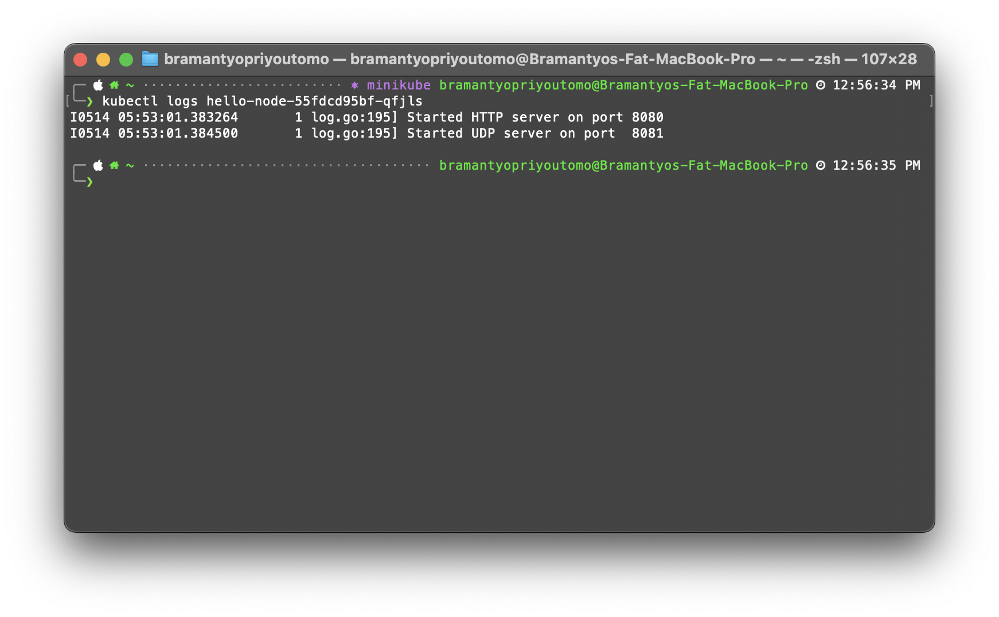
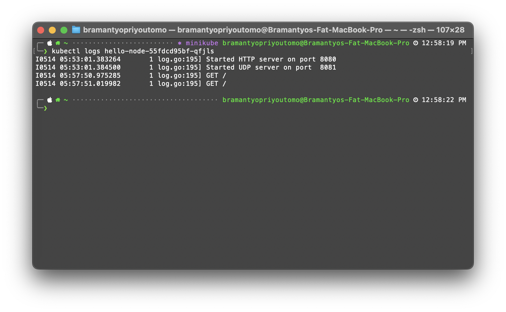

# Advanced Programming - Tutorial 11

### Reflection on Hello Minikube

1. Compare the application logs before and after you exposed it as a Service.

Before exposing the application as a Service, the logs show the initialization of the servers:



After exposing the application as a Service, additional log entries appear, indicating that the application is now receiving HTTP requests:



The log analysis indicates that exposing the application as a Service in Kubernetes successfully routes incoming HTTP requests to the application. The increase in log entries, specifically the HTTP GET requests, confirms that the application is receiving and handling client requests. Each access to the app results in a new log entry, verifying the application's response to the external requests.

2. Notice that there are two versions of `kubectl get` invocation during this tutorial section.

```shell
kubectl get pods,services
```

This command retrieves all pods and services in the default namespace.
If pods and services are created in a specific namespace other than the default, they won’t be listed here because this command does not include the -n option to specify a namespace.

```shell
kubectl get pods,services -n kube-system
```

The -n kube-system specifies that the command should operate in the kube-system namespace, which is typically used by Kubernetes for system-level pods and services, such as the Kubernetes dashboard, DNS server, etc.

Example of `kubectl get` using `-n`


